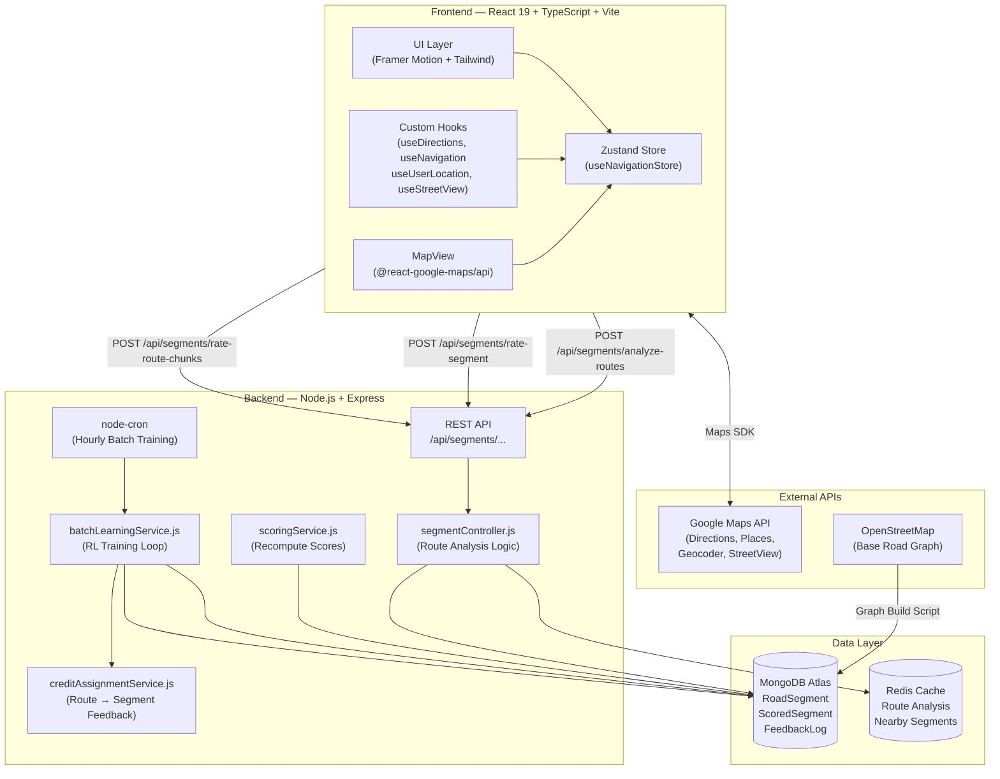
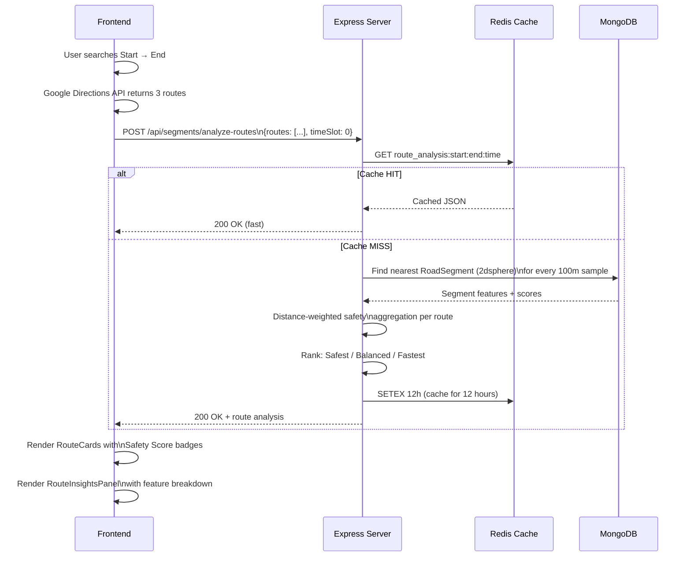
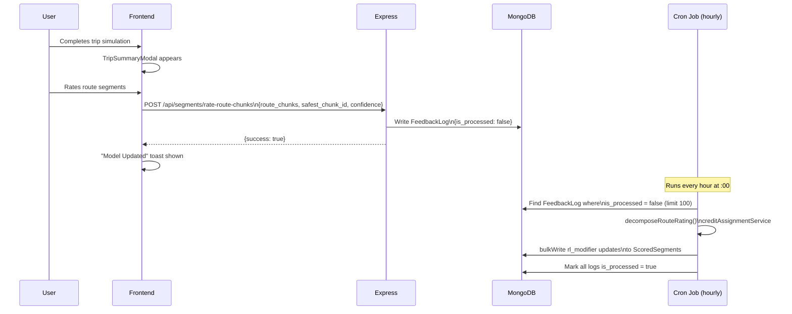

# Midnight Maps
### *Midnight Maps — AI-Powered Safety Navigation for the Night*

[](https://reactjs.org/)
[](https://www.typescriptlang.org/)
[](https://nodejs.org/)
[](https://mongodb.com/)
[](https://redis.io/)
[](https://developers.google.com/maps)
[](https://www.python.org/)
[]()
[]()

---


**A comprehensive full-stack navigation platform that scores every road segment for night-time safety using infrastructure data (street lighting + CCTV coverage), ambient activity patterns, and a live Reinforcement Learning feedback loop — so your route suggestions actually improve the more people use it.**

<p align="center">
  <a href="https://midnight-maps.vercel.app"><b>🌍 Try Live App</b></a> &nbsp;&nbsp;|&nbsp;&nbsp;
  <a href="https://youtu.be/AAlChO91CCU"><b>📺 Watch Demo</b></a> &nbsp;&nbsp;|&nbsp;&nbsp;
  <a href="#getting-started"><b>💻 Run on Local Machine</b></a>
</p>

---

</div>

##  The Problem

Existing navigation apps (Google Maps, Apple Maps) optimize **purely for speed**. They don't know:

- Whether a street is lit at 2 AM
- Whether there are CCTV cameras providing passive surveillance
- Whether foot traffic makes the area feel safe
- Whether the route passes through isolated underpasses or dead-ends

**Midnight Maps** fills this gap by building a city-wide **safety graph** on top of OpenStreetMap road data, enriched with real CCTV camera positions, street lamp data, and user feedback, then using a **Reinforcement Learning agent** to continuously improve its scoring model.

---
## Midnight Maps - Landing Page


---

##  Feature Showcase

# Route Ranking based on Safety

Three routes are compared simultaneously and ranked as **Safest**, **Balanced**, or **Fastest**—backed by real-time safety computation.

<table>
  <tr>
    <td width="30%" valign="top" rowspan="2">
      
    </td>
    <td width="70%" valign="top">
      <h3>Scoring Logic</h3>
      <p>Routes are processed through a multi-factor function that adjusts dynamically based on environmental shifts:</p>
      <code>Route Score = f(Lighting, Surveillance, Activity, Environment)</code><br>
      <code>&nbsp;&nbsp;&nbsp;&nbsp;&nbsp;&nbsp;&nbsp;&nbsp;&nbsp;&nbsp;&nbsp;&nbsp;&nbsp;× Time-of-Day Weights × Dark & Deserted Penalty</code>
      <br><br>
      <table>
        <thead>
          <tr>
            <th>Badge</th>
            <th>Optimization Formula</th>
          </tr>
        </thead>
        <tbody>
          <tr>
            <td>🟢 <b>Safest</b></td>
            <td><code>meanSafety × 0.7 + minScore × 0.3</code></td>
          </tr>
          <tr>
            <td>🔵 <b>Balanced</b></td>
            <td><code>meanSafety - (timePenalty × 0.75)</code></td>
          </tr>
          <tr>
            <td>🟡 <b>Fastest</b></td>
            <td><code>min(travel_duration)</code></td>
          </tr>
        </tbody>
      </table>
    </td>
  </tr>
  <tr>
  </tr>
</table>

---
###  CCTV Camera Overlay

<p align="center" style="display: flex; justify-content: space-between;">
  
  
</p>

This Toggle button shows an overlay of all the cameras present in the region according to our dataset , For users the cameras can be shown in their Proximity (eg: ALL cameras within 50 m radius ) , but currently all the cameras are shown to validate how correctly our algorithm measures safety based on the cameras present.

#####  How CCTV Influences Safety Scores

Camera presence applies a dynamic **×1.35 multiplier** to the raw camera feature value (capped at a maximum of `1.0`).
Because visibility is more critical after dark, this score carries different weights depending on the time of day.

DAY - 10 %
NIGHT - 15 %

**The Calculation:**
```text
C_final = min(1.0, C_raw × 1.35)
```
---

###  Street Lamp Overlay

<p align="center" style="display: flex; justify-content: space-between;">
  
  
</p>

Toggling the **street lighting layer** shows amber dot markers at every recorded lamp position from `koramangala_street_lamps.json` file. Currently this is done to demonstrate how the lightness and the safety scores are influenced by the street lamps present . Later for users , the lamps can be shown in their proximity or on their navigating path.

**Why lighting is critical at night:** At night, lighting carries **40% weight** in the safety formula.
A `lighting < 0.3` triggers an additional **15–30% penalty** on the base score.

---

### Route Intelligence Panel

After the route analysis is complete, a collapsible **Route Intelligence** panel provides a transparent breakdown of exactly why a route received its safety score.

<table>
  <tr>
    <td width="35%" valign="top">
      
    </td>
    <td width="65%" valign="top">
      <h4>Nighttime Scoring Weights</h4>
      <p>The algorithm adapts its weighting based on the time of day. Below is the breakdown for nighttime routing:</p>
      <table>
        <thead>
          <tr>
            <th>Metric</th>
            <th>Data Source</th>
            <th>Weight (Night)</th>
          </tr>
        </thead>
        <tbody>
          <tr>
            <td> <b>Lighting</b></td>
            <td><code>features.lighting[timeSlot]</code></td>
            <td><b>40%</b></td>
          </tr>
          <tr>
            <td> <b>Surveillance</b></td>
            <td><code>features.camera × 1.35</code></td>
            <td><b>15%</b></td>
          </tr>
          <tr>
            <td><b>Activity</b></td>
            <td><code>features.activity[timeSlot]</code></td>
            <td><b>25%</b></td>
          </tr>
          <tr>
            <td><b>Context</b></td>
            <td><code>features.environment</code></td>
            <td><b>20%</b></td>
          </tr>
        </tbody>
      </table>
      <p align="right"><small><i>Weights shift dynamically during daylight hours to prioritize activity and environment over lighting.</i></small></p>
    </td>
  </tr>
</table>

---

###  Map Overlay icons

The routing interface features a robust set of toggleable map layers on the right-hand panel. This allows users to visualize the exact environmental data driving their route's safety score.


| Control  | Overlay Layer | Description & Routing Impact |
| :---: | :--- | :--- |
|  | **Base Map** | Toggles satellite imagery . |
|  | **Traffic** | Shows Traffic layer . |
|  | **Open shops and Police Nearby** | Displays Nearby open shops and Police Station nearby so users can feel safe on night streets. |
|  | **Show Cameras** | Overlays the map with cameras present |
|  | **Show Lamps** | Overlays the map with Lamps present |
|  | **Midnight Toggle ** | This Toggles the current time to midnight so that users can inspect the safety in a night environment , also Needed for demonstration purposes |
|  | **Show My location** | On toggling Users current location is shown |
|  | **Street View Pegman** | Users can drag and drop to see street views |
|  | **Safety Inspector** | Shows all the safety metrics of a street |

---

### Safety Inspector (Street-Level)

<table>
  <tr>
    <td width="40%" valign="top">
      
      
    </td>
    <td width="60%" valign="top">
      <h4>Deep Dive into Segment Data</h4>
      <p>The <b>Safety Inspector</b> mode empowers users to interrogate any individual road segment directly on the map. Instantly retrieve raw safety metrics without ever leaving your navigation flow.</p>
      <hr>
      <h5>Instant Safety Metrics Shown:</h5>
      <ul>
        <li> <b>Lighting Profile:</b> View current illumination levels and identify potential dark zones.</li>
        <li> <b>Camera Coverage:</b> Verify the density of active surveillance and CCTV presence.</li>
        <li> <b>Activity Profile:</b> Check live foot traffic.</li>
        <li> <b>Environment Context:</b> See Whether the street is in residential safe area or isolated empty area.</li>
      </ul>
      <br>
      <blockquote>
        <i> The images here show how lighting is affected by the presence of street lamps , both the images are of night time hence low lighting score </i>
      </blockquote>
    </td>
  </tr>
</table>

------

###  Navigation Simulation

**Note on Simulation:** This feature was built specifically for the hackathon environment. Because I cannot practically field test routing over roads at night, so I built this simulation engine. It allows users and judges to experience the full navigation flow, UI transformations, and post-trip Reinforcement Learning feedback loop directly from their browser.


A full route simulation engine drives a marker along the selected route at configurable speed (default 12 m/s ≈ 43 km/h). During simulation:

- The map **rotates and tilts** with vehicle heading (60° tilt on vector-enabled maps)
- A **Navigation HUD** shows turn-by-turn instructions with distance countdowns
- The sidebar collapses for an immersive full-screen experience
- On completion, a **Trip Summary Modal** collects segment-level feedback
- There is option to see nearby open shops and police stations while navigating , so that users can feel safe.

---

###  Google Street View Integration

<p align="center" style="display: flex; justify-content: space-between;">
  
  
</p>

A **Pegman control** lets users drop into Street View panorama at any location to visually validate the AI's safety assessment before committing to a route.
In the images Shown we can see , how the environment is assessed using the street view images , for the street shown in the first image environment context is higher while lower for that in second image. Also the reason for low lighting is that the screenshot was taken at night time .

---

###  Community Feedback Loop


After every trip, a **Segment Rating Panel** chunks the route into geographic parts based on turns taken and asks the user to choose the safest or most unsafe part. This feedback is logged to **FeedbackLog** and processed by the RL agent.

---

## System Architecture



---

##  Safety Scoring Algorithm

Each road segment in the city has **4 features** extracted at import time. The safety score is **not static** — it is computed per 2-hour time slot across a 24-hour cycle.

### Feature Weights

```
┌─────────────────────────────────────────────────────────┐
│              TIME-ADAPTIVE SAFETY WEIGHTS               │
├───────────────┬─────────────────┬───────────────────────┤
│  Feature      │  Night Weight   │  Day Weight           │
├───────────────┼─────────────────┼───────────────────────┤
│  Lighting     │  40%            │  50% (forced to 1.0)  │
│  Activity     │  25%            │  10%                  │
│  Environ.     │  20%            │  30%                  │
│  Camera       │  15%            │  10%                  │
└───────────────┴─────────────────┴───────────────────────┘
```

### Score Formula

```
computeSafetyScore(features, timeSlot t):

1. Extract values:
   L = lighting[t]            (0.0 – 1.0)
   A = activity[t]            (0.0 – 1.0)
   E = environment            (0.0 – 1.0, static)
   C = min(1.0, camera × 1.35)

2. Select weights:
   if isDaytime(t):  L = 1.0  (sun provides 100% illumination)
   weights = DAY_WEIGHTS if isDaytime else NIGHT_WEIGHTS

3. Base score:
   score = L×wL + A×wA + E×wE + C×wC

4. Penalties:
   if L < 0.3 AND A < 0.3:  score ×= 0.70   ← "Dark & Deserted"
   elif L < 0.3:            score ×= 0.85   ← "Just Dark"

5. Late-night cap:
   if t ∈ {0, 1}:  score = min(score, 0.90)  ← 12AM–4AM vulnerability

6. Clamp:
   return clamp(score, 0.02, 0.98)
```
---

## Reinforcement Learning Pipeline

The system uses a **tabular RL approach** inspired by temporal-difference learning. Rather than a neural network (which would be overkill for the data volume), it maintains a **`rl_modifier` float per segment** that shifts the pre-computed base score up or down based on community feedback.

### RL Update Rule

```
RL Update (Batch, every hour via cron): schedule of updation can be adjusted

For each new FeedbackLog:
  error = target_score - current_total_score
  weight = confidence × time_slot_confidence × learning_weight

Weighted average across all feedback for segment S:
  avg_error = Σ(error × weight) / Σ(weight)

Update rule:
  rl_modifier[S] += α × avg_error    (α = 0.20)

Clamp:
  rl_modifier[S] = clamp(rl_modifier[S], -0.30, +0.30)
```
---

## Data Flow

### Route Analysis Request Flow



### Feedback → RL Training Flow



---

## Tech Stack

### Frontend

| Technology | Role |
|-----------|------|
| **React 19** | Component framework |
| **TypeScript 5.9** | Type safety throughout |
| **Vite 8** | Build tool & dev server |
| **Framer Motion** | Spring animations, page transitions |
| **Zustand** | Global state management |
| **@react-google-maps/api** | Maps SDK wrapper |
| **Tailwind CSS 3** | Utility-first styling |
| **Lucide React** | Icon library |

### Backend

| Technology | Role |
|-----------|------|
| **Node.js + Express** | REST API server |
| **MongoDB + Mongoose** | Primary datastore (2dsphere geo-queries) |
| **Redis** | Response caching (12h TTL for route analysis) |
| **node-cron** | Hourly RL batch training scheduler |

### AI / Algorithms

| Component | Technique |
|-----------|-----------|
| **Safety Scoring** | Weighted multi-feature linear model (time-adaptive) |
| **RL Update** | Tabular temporal-difference (α=0.20, clamped modifier) |
| **Credit Assignment** | Inverse-safety proportional weighting |
| **Route Analysis** | Distance-weighted spatial averaging + chokepoint detection |
| **Geo-querying** | MongoDB 2dsphere index, Haversine distance |

---

##  Getting Started

### Prerequisites

| Dependency | Version | Purpose |
|-----------|---------|---------|
| Node.js | ≥ 18.x | Runtime for frontend & backend |
| npm | ≥ 9.x | Package manager |
| MongoDB | Atlas or local 6.x | Primary database |
| Redis | 7.x | Caching layer |
| Google Maps API Key | — | Maps, Directions, Places |

#### 1. Clone the Repository

```bash
git clone https://github.com/aprajita-99/Midnight-Maps.git
cd Midnight-Maps
```
#### 2. Configure Environment Variables

Frontend `.env` (project root)

```env
VITE_GOOGLE_MAPS_API_KEY = your-api-key
MONGODB_URI=your-database-url ( database here is very important because of all the data being present here )
VITE_API_BASE_URL=https://localhost:5000
RL_TRAINING_INTERVAL_MS=300000
```

**Required Google Maps APIs to enable:**
- Maps JavaScript API
- Directions API
- Places API
- Geocoding API
- Street View Static API

Backend `.env` (`/backend/.env`)

```env
PORT=5000
MONGODB_URI=your-database-URL
NODE_ENV=development
REDIS_URL=your-Redis_URL

```

#### 3. Install Dependencies

```bash
# Frontend dependencies
npm install

# Backend dependencies
cd backend
npm install
cd ..
```

#### 4. Seed the Database

Import the road graph and safety features into MongoDB:

```bash
Step 1 - Run the script enrich_activity.py to fill the database with the segments and their activity values
Step 2 - Run the script update_lighting.py to update the database with lighting values.
Step 3 - Run the script update_camera.py to update the database with camera feature values.
Step 4 - Download the model from the link given (http://places2.csail.mit.edu/models_places365/resnet50_places365.pth.tar)
Step 5 - With the model and Categories365 fil , Run the script fill_environment.py
Step 6 - run recompute_safety_scores.py
- All done
```

> **Note:** The datasets directory contains pre-processed JSON files. The seed scripts read these files and insert them into the `road_segments` and `scored_segments` MongoDB collections with proper 2dsphere indices.

#### 5. Run the Application

**Terminal 1 — Backend Server:**
```bash
cd backend
npm start
# Server running on http://localhost:5000
```

**Terminal 2 — Frontend Dev Server:**
```bash
# From project root
npm run dev
# App running on http://localhost:5173
```

**Terminal 3 (optional) — Watch backend logs for RL training:**
```bash
cd backend
npm run dev
```

### 6. Verify the Setup

Open `http://localhost:5173` in your browser. You should see:

1.  The **Midnight Maps** loading screen appears briefly
2.  A dark-themed map centered on **Koramangala, Bangalore**
3.  The left sidebar shows **Search Bar** and **Travel Mode** tabs
4.  Map controls (camera, lamp, traffic toggles) appear top-right

Test route analysis:
1. Type a start location (e.g., "Forum Mall, Koramangala")
2. Type an end location (e.g., "Indiranagar, Bangalore")
3. Click **Search** — routes should appear with safety scores
4. Click **Start Simulation** to launch the navigation HUD

---

##  Data Schema

#### RoadSegment (MongoDB)

```
segment_id       String    — Unique (e.g., "12.9353_77.6251:12.9361_77.6255")
start            {lat, lng} — Segment start coordinate
end              {lat, lng} — Segment end coordinate
midpoint         {lat, lng} — Used for geo-indexing
location         GeoJSON Point — 2dsphere index on midpoint
features:
  lighting       Number[12] — Lighting value per 2h slot (0–1)
  activity       Number[12] — Foot-traffic intensity per slot (0–1)
  camera         Number     — Normalized CCTV presence (0–1)
  environment    Number     — Static environmental risk factor (0–1)
```

### ScoredSegment (MongoDB)

```
segment_id       String    — FK → RoadSegment.segment_id
scores           Number[12] — Safety score per 2h time slot (0.02–0.98)
rl_modifier      Number    — Community feedback delta (−0.30 to +0.30)
rating_count     Number    — Total ratings received
last_rated_at    Date      — Timestamp of last update
```

### FeedbackLog (MongoDB)

```
segment_ids       [String]  — Affected segments
ratings           [{segment_id, rating, target_score}]
feedback_type     Enum      — "segment" | "route" | "segment_fine_grained"
time_slot         Number    — 0–11 (which 2h window)
time_slot_confidence Number — How certain about the time (0–1)
confidence        Number    — User's self-reported certainty (0–1)
learning_weight   Number    — Spam-adjusted weight (0–1)
is_processed      Boolean   — Has RL agent consumed this?
user_context:
  location        GeoPoint  — User's coordinates at time of feedback
  weather         String
  lighting_conditions String
  companion_count Number
```
---

## Datasets and Models Used

### `koramangala_cameras.json`
~250 CCTV camera locations in the Koramangala area sourced from civic mapping data.
~fetched using API - "https://overpass-api.de/api/interpreter"

### `koramangala_street_lamps.json`
~1,500 street lamp positions providing granular lighting coverage data.
~fetched using API - "https://overpass-api.de/api/interpreter"

### `bangalore_city_full.json`
Full OpenStreetMap road graph for Bangalore city (~12k nodes, edges encoded as segment pairs).
~fetched using osmnx python Library.

### `365Places Model`
Downloaded From - http://places2.csail.mit.edu/models_places365/resnet50_places365.pth.tar

---

<div align="center">

**Midnight Maps**

</div>
